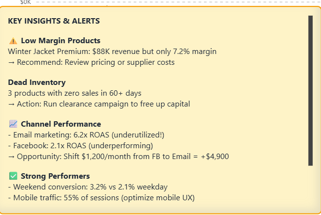

E-Commerce Analytics Dashboard

Interactive Power BI dashboard that transforms raw sales data into actionable business intelligence

🎯 The Problem
Online retailers struggle with:

Hidden profit leaks - Products with high revenue but razor-thin margins
Wasted marketing spend - Can't see which channels actually drive profitable sales
Dead inventory - Products sitting unsold for months, tying up capital
Missed opportunities - Don't know when/where customers convert best

Result: 30-40% of potential profit left on the table.
✨ The Solution
An automated analytics dashboard that instantly identifies:
✅ Profit killers - High-revenue products that actually lose money
✅ Marketing waste - Channels with poor ROAS (Return on Ad Spend)
✅ Hidden patterns - When and where customers convert best
✅ Inventory issues - Stock alerts and slow-moving products
✅ Growth opportunities - Underutilized high-performing channels
📊 Key Features
Executive Overview Dashboard

Real-time KPIs: Revenue, orders, AOV, profit margin with YoY/MoM comparisons
Revenue forecasting: Trend analysis with 3-month projections
Channel performance: Website, mobile, Instagram, Facebook breakdown
Geographic insights: Sales distribution by city/country
Automated alerts: Flags problems automatically so you don't have to dig

Intelligent Alert System
The dashboard doesn't just show data - it tells you what's broken:

Sample insights generated:

⚠️ "Winter Jacket: $47K revenue but only 7.2% margin - Review pricing or supplier"
📈 "Email marketing: 6.2x ROAS but underutilized - Shift budget from Facebook"
💀 "3 products with zero sales in 60+ days - Run clearance campaign"
✅ "Weekend conversion 3.2% vs 2.1% weekday - Schedule promotions Fri-Sun"

🔍 Business Impact
For E-commerce Managers:

Identify profit leaks in under 5 minutes
Make data-driven inventory decisions
Optimize product mix based on actual profitability

For Marketing Teams:

See true ROAS by channel, campaign, and audience
Understand customer acquisition costs
Reallocate budgets to highest-performing channels

For Executives:

Single source of truth for business health
Revenue forecasting for planning
Quick identification of growth opportunities

🛠️ Technical Stack

Platform: Power BI Desktop
Data Transformation: Power Query (M language)
Calculations: DAX (20+ custom measures)
Data Source: E-commerce transaction data (5 tables, 12 months, 13K+ transactions)

Key Technical Features

Time intelligence calculations (YoY, MoM growth)
Conditional formatting with dynamic thresholds
Cross-visual filtering and drill-through capabilities
Automated insight generation using DAX logic
Interactive slicers with date range presets

🚀 How to Use

Download the .pbix file (or clone this repo)
Open in Power BI Desktop (free download from Microsoft)
Refresh data connections if needed
Explore the interactive dashboard

💡 Sample Insights from Real Data
Profit Analysis:

Winter Jacket generates $47K revenue but only 7.2% profit margin (industry standard: 15-20%)
Sports category averages 42% margin - highest performer
3 products tied up $12K in capital with zero sales in 90+ days

🎓 Key Learnings
This project demonstrates:

Advanced DAX measure creation
Data modeling and relationship management
Visual design principles for business dashboards
Translating data into actionable business recommendations
Storytelling with data

📫 Let's Connect
Need a custom analytics dashboard for your business?
I specialize in transforming complex data into clear, actionable insights for e-commerce and retail businesses.

📧 Email: whomebilal11@gmail.com
💼 LinkedIn: https://www.linkedin.com/in/rizvibilal/
