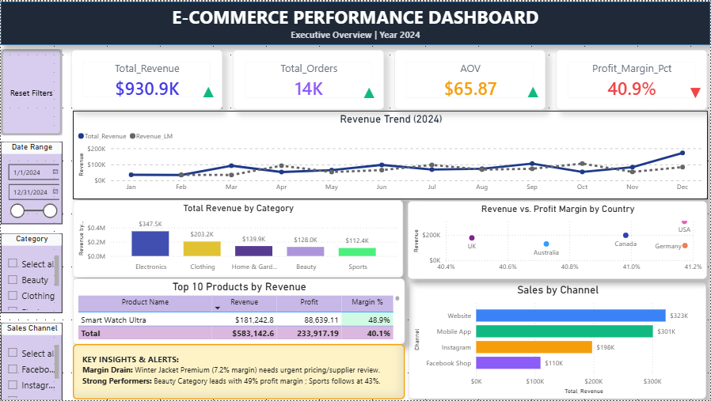
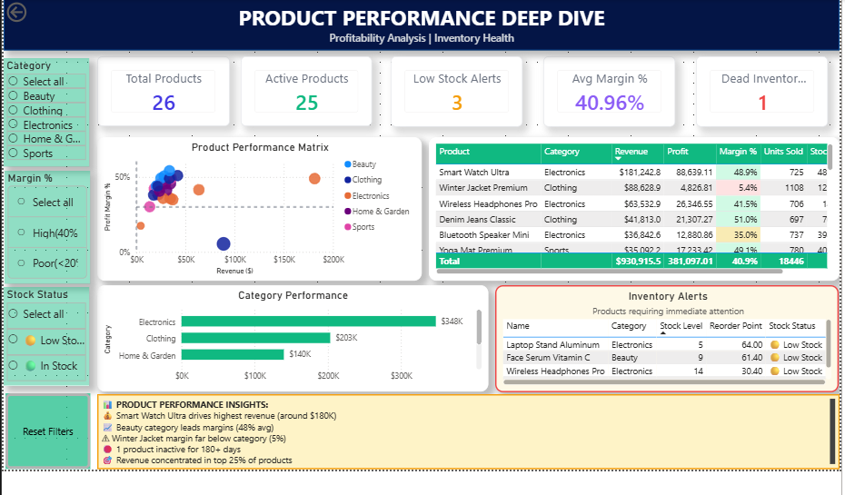
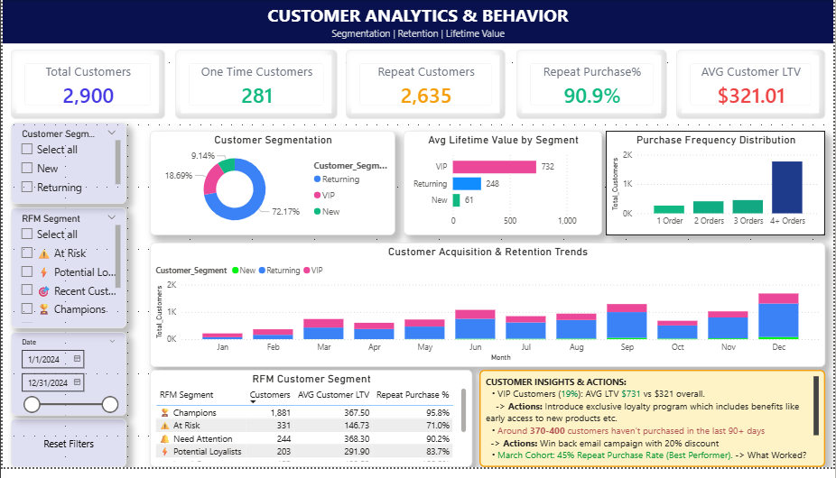

E-Commerce Analytics Dashboard

Interactive Power BI dashboard that transforms raw sales data into actionable business intelligence for online retailers

## 📖 Table of Contents
* [🎯 The Problem](#-the-problem)
* [✨ The Solution](#-the-solution)
* [📊 Key Features](#-key-features)
* [🛠️ Technical Stack](#️-technical-stack)
* [📫 Contact](#-contact)

🎯 The Problem

Online retailers struggle with:

Hidden profit leaks - Products with high revenue but razor-thin margins
Wasted marketing spend - Can't identify which channels drive profitable sales
Dead inventory - Products sitting unsold for months, tying up capital
Poor customer retention - Don't know which customers are at risk of churning
Scattered data - Information spread across Shopify, Google Analytics, Facebook Ads, etc.

Result: 30-40% of potential profit left on the table.

✨ The Solution

A comprehensive 4-page Power BI dashboard that automatically:
✅ Identifies profit killers (high-revenue, low-margin products)
✅ Flags marketing waste (poor ROAS channels)
✅ Segments customers by value (RFM analysis)
✅ Tracks inventory health (stock alerts, dead inventory)
✅ Recommends budget optimization (+$8,600/month potential)
✅ Forecasts revenue trends (3-month projections)

📊 Key Features

1. Executive Overview

Real-time KPIs: Revenue, profit margin, AOV, order volume
Revenue forecasting: Trend analysis with 3-month projections
Automated alerts: "Winter Jacket: $47K revenue but only 7% margin"
Channel breakdown: Website, mobile, Instagram, Facebook performance
Geographic insights: Sales distribution by location

2. Product Performance Analysis

Performance matrix: 4-quadrant analysis (Stars, Cash Cows, Question Marks, Dogs)
Profit margin tracking: Color-coded conditional formatting
Inventory alerts: Low stock warnings, reorder point notifications
Dead inventory detection: Products with 60+ days no sales
Category benchmarking: Margin health by product category

3. Customer Analytics

RFM segmentation: Champions, Loyal, At-Risk, Hibernating customers
Lifetime value analysis: Customer worth by segment
Retention metrics: Repeat purchase rate, purchase frequency
Behavioral patterns: One-time vs. repeat buyer analysis
Geographic distribution: Customer location mapping

🛠️ Technical Stack

**Core Technologies:**

Power BI Desktop - Dashboard development and visualization
DAX - 30+ custom measures for calculations and business logic
Power Query (M) - Data transformation and ETL
Python - Dataset generation and automation

Pandas - Data manipulation
NumPy - Numerical operations

**Data Architecture:**

Data Model: Star schema with 5 dimension tables
Relationships: One-to-many between fact and dimension tables
Row Count: 13,000+ transactions, 3,000 customers, 25 products
Time Period: 12 months (Jan 2024 - Dec 2024)

**Key Technical Features:**

Time intelligence calculations (YoY, MoM growth)
Conditional formatting with dynamic thresholds
Cross-visual filtering and drill-through
Automated insight generation using DAX logic
Interactive slicers with preset date ranges
RFM customer segmentation algorithm

**🚀 Installation & Setup:**
Prerequisites

Power BI Desktop (free) - Download here
Python 3.8+ (for data generation) - Download here

Option 1: Quick Start (Use Pre-Generated Data)

Clone the repository

bash   
git clone https://github.com/bilalrizvi21/ecommerce-analytics-dashboard.git
   cd ecommerce-analytics-dashboard

Open the dashboard

Double-click Ecommerce_Dashboard_Portfolio.pbix

Power BI Desktop will open automatically

Data is already loaded and ready to explore

Start exploring!

Click through the 4 pages

Use slicers to filter by date, category, channel

Hover over visuals for detailed tooltips

Option 2: Generate Fresh Data

Install Python dependencies

bash   pip install pandas numpy

Run data generation script

bash   cd scripts
   python generate_ecommerce_data.py

Load into Power BI

Open Ecommerce_Dashboard_Portfolio.pbix

Home → Transform Data → Data source settings

Point to newly generated CSV files in /data folder

Refresh

**🎓 Key Learnings**:

This project demonstrates:

Technical Skills

- Advanced DAX measure creation (time intelligence, customer segmentation)

- Data modeling with star schema design

- ETL pipeline development using Power Query

- Python for data generation and automation

- Conditional formatting and dynamic visualizations

**Business Analytics**:

- Customer segmentation using RFM methodology

- Marketing attribution and ROAS analysis

- Product profitability tracking

- Inventory health monitoring

- Revenue forecasting techniques

**Data Storytelling**:

- Translating complex data into actionable insights

-Designing executive-friendly dashboards

- Creating automated alert systems

- Building business recommendations from data

**📝 Use Cases**:

For E-commerce Managers

- Identify profit leaks in under 5 minutes

- Make data-driven inventory decisions

- Optimize product mix based on profitability

For Marketing Teams

- See true ROAS by channel and campaign

- Understand customer acquisition costs

- Reallocate budgets to highest-performing channels

For Executives

- Single source of truth for business health

- Revenue forecasting for financial planning

- Quick identification of growth opportunities

**📫 Contact**

Bilal Rizvi

LinkedIn: linkedin.com/in/rizvibilal

GitHub: github.com/bilalrizvi21

Email: whomebilal11@gmail.com

**Need a custom analytics dashboard for your business?**
I specialize in transforming complex data into clear, actionable insights for e-commerce and retail businesses. Let's talk about your data challenges.

🙏 Acknowledgments

Dataset structure inspired by real e-commerce transaction patterns

Dashboard design principles from Microsoft Power BI best practices

Color schemes optimized for accessibility and business context

**⭐ Star:**

If you found this project helpful, please consider giving it a star!

